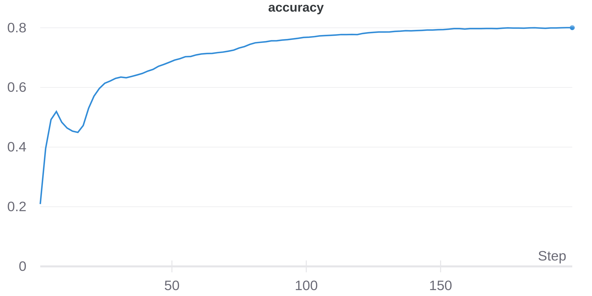
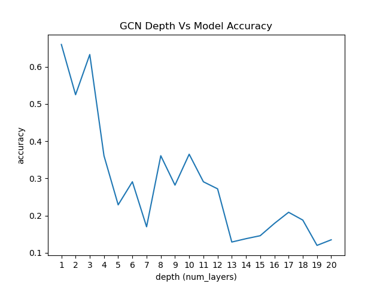

# Graph Convolution Networks Benchmarks

In This project i tested gcn in a bunch of ML Tasks
- Node Classification
- The impact of GCN Depth/Width on accuracy
- Apply Transfer Learning on Node Classification
- Visualize K-hops neighbors in Graphs


### Project Requirements

- torch
- dgl
- wandb
- matplotlib
- numpy


## Node Classification Test

#### Cora Dataset
- Nodes: 2708
- Edges: 10556
- Graph Diameter: 20
- Node Features: 1433
- Num Classes: 7

   


#### Pubmed Dataset
- Nodes: 19717 
- Edges: 88651
- Graph Diameter: 3.7 ~ 4 (90-percentile effective diameter)
- Node Features: 500
- Num Classes: 3

   

#### What each node in GNN see with K layers

##### 2 Layer GCN


##### 10 Layer GCN


#### Over Smoothing problem in GNNs



#### GCN Width Vs Accuracy


#### Feature transformation in GCN


### Block Based GCN Vs Flat GCN

##### GNN Blocks Design
 

 


### References

```
@misc{kipf2017semisupervised,
      title={Semi-Supervised Classification with Graph Convolutional Networks}, 
      author={Thomas N. Kipf and Max Welling},
      year={2017},
      eprint={1609.02907},
      archivePrefix={arXiv},
      primaryClass={cs.LG}
}

@misc{wandb,
title = {Experiment Tracking with Weights and Biases},
year = {2020},
note = {Software available from wandb.com},
url={https://www.wandb.com/},
author = {Biewald, Lukas},
}

@misc{wang2020deep,
      title={Deep Graph Library: A Graph-Centric, Highly-Performant Package for Graph Neural Networks}, 
      author={Minjie Wang and Da Zheng and Zihao Ye and Quan Gan and Mufei Li and Xiang Song and Jinjing Zhou and Chao Ma and Lingfan Yu and Yu Gai and Tianjun Xiao and Tong He and George Karypis and Jinyang Li and Zheng Zhang},
      year={2020},
      eprint={1909.01315},
      archivePrefix={arXiv},
      primaryClass={cs.LG}
}
```