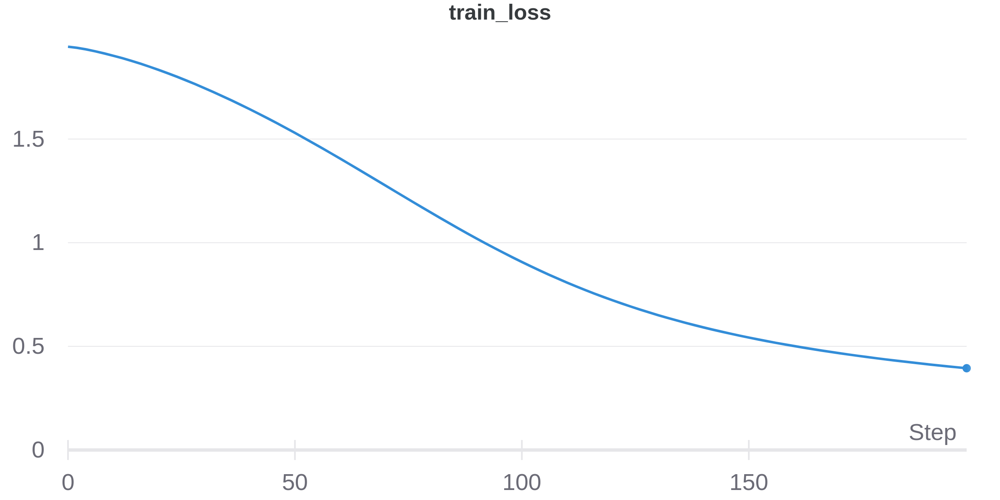
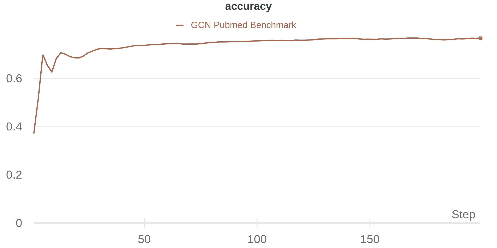

# Machine Learning Project Template

This is a project template to help me go faster when testing new models

### Project Requirements

- torch
- dgl
- wandb
- matplotlib
- numpy

## Node Classification Test

#### Cora Dataset
- Nodes: 2708
- Edges: 10556
- Graph Diameter: 20
- Node Features: 1433
- Num Classes: 7

   

#### Pubmed Dataset
- Nodes: 19717 
- Edges: 88651
- Graph Diameter: 3.7 ~ 4 (90-percentile effective diameter)
- Node Features: 500
- Num Classes: 3

   
